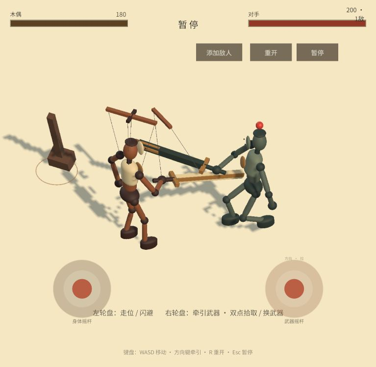

# Let the Show Begin · 好戏开演

A Unity dual-stick combat experiment inspired by hands-on weapon interaction in VR. Move with the left stick and steer your weapon with the right: your weapon's motion is the attack, rather than a button-triggered move. Together, the two sticks create the feeling of guiding a dancing marionette.

一个区别于传统“移动摇杆 + 攻击按钮”的双摇杆战斗交互原型。左摇杆控制走位，右摇杆直接牵引武器运动；两个摇杆配合，让握腕、手臂、躯干和脚步跟着转动，形成操控提线木偶的感觉。玩家画出的武器轨迹本身就是攻击，而不是按下按钮后播放一套预制招式。

## Play online · 立即试玩

[打开网页版 / Play in your browser](https://bugxching.github.io/let-the-show-begin/)

无需安装 Unity 或下载客户端。手机和平板建议横屏，左右摇杆可以同时操作；电脑使用 WASD 走位、方向键挥动武器。首次进入需要下载游戏文件，请等待加载完成。

网页由 GitHub Pages 托管，不依赖作者的电脑开机。游戏在试玩者设备中运行，无常驻服务器、账号系统或联网对战。中国大陆不同网络的访问速度可能有差异。

## 交互理念与灵感

灵感来自 VR 游戏中亲手挥动武器、与敌人交锋的交互场景。本项目尝试把这种直接操控武器的参与感，转译到手机、平板和普通电脑上的双摇杆操作中：左手调节距离与走位，右手推动、转动摇杆来挥动武器，再由实际轨迹、运动速度与碰撞决定战斗反馈。

核心体验是：“我不是按按钮让角色自动出招，而是在亲手牵引一具木偶，让它完成一场战斗舞蹈。”两只手同时操作时，希望玩家感觉自己正在挥动武器与敌人战斗，而不只是给角色下达攻击指令。

这不是 VR 应用，也不宣称完整还原真实挥剑或全身物理。它是一项关于“双摇杆能否成为直接武器操控方式”的可玩实验，开放代码是为了分享实现方法、局限与开发经验，方便后来者研究和继续尝试。

项目来自第一次游戏开发实验，现以可运行的灰盒 Demo 形式整理，供开发者研究输入映射、程序化动作与碰撞反馈。重点是玩法实现，不包含精制角色、美术包装或联网系统。



## 快速运行

1. 用 Unity Hub 打开工程，使用 **Unity 6000.6.3f1**。在 Hub 中安装对应版本的 Web Build Support，才可导出网页。
2. 等待 Package Manager 还原依赖。
3. 打开 `Assets/Scenes/HaoxiArena.unity`，点击 Play。场景只有入口组件，人物、武器、舞台与 UI 在运行时创建。
4. 通过菜单 **好戏开演 → 构建 WebGL试玩包** 导出到 `Build/WebGL/`。

项目主要依赖 URP 17.6、Input System 1.20、uGUI 2.6 和 Test Framework 1.8；确切版本以 `Packages/` 的 manifest 和锁文件为准。源码包不包含 Unity Editor、缓存或已下载的包。

构建后，在工程根目录启动本地网页：

```sh
python3 tools/serve_webgl.py --port 8765
```

打开 <http://127.0.0.1:8765/>。WebGL 通过 HTTP 加载，不能直接双击 `index.html`。公开部署和打包步骤见 [构建与验证](docs/TESTING.md)。

## 操作

| 输入 | 作用 |
| --- | --- |
| 左摇杆 / WASD / 手柄左摇杆 | 地面走位，加速、减速与换向 |
| 右摇杆 / 方向键 / 手柄右摇杆 | 水平牵引武器，带动身体转身 |
| Shift + 方向键 | 更快地改变键盘武器输入 |
| 鼠标在舞台中部按住左键拖动 | 用平面投影指定武器牵引方向 |
| 双点右摇杆 | 附近有武器时拾取或换武器；没有时放下当前武器 |
| 暂停按钮 / Esc | 暂停或恢复 |
| 重开按钮 / R | 重置场景，恢复一个敌人 |
| 添加敌人按钮 | 增加一个持不同武器的敌人，最多同时存活 12 个 |

左右触屏摇杆分别拥有各自的触点，可以同时走位和挥击。建议手机横屏试玩。

## 当前实现

- 独立的地面移动与武器牵引；移动加速度、角度弹簧和武器刚体力／力矩。
- 胸、胯的不同转动惯性；非对称 Pose、两段式 IK、行走、跑动、旋转换脚与少量受约束滑步。
- 15 个物理部位和 ConfigurableJoint；受击时局部肌肉放松，死亡后保留肢体连接倒地。
- 跨物理帧的刀刃扫掠；按实际运动速度、武器质量、接触位置和部位计算伤害。
- 武器格挡，轻击／重击／击飞，击飞落地后倒地和起身，死亡保持倒地。
- 颈部、手腕、膝盖的累计关节损伤；掉武器、断腿减速和颈部致命破坏。
- 七种已实现的刚性武器参数、掉落与拾取；玩家默认木刀，敌人轮换其他武器。
- 敌人追击、侧移、闪避、轻重击选择、攻击槽协调和同伴间距。
- 跟随镜头、生命值、短暂停顿、刀轨、墨点和程序化占位音效。

增益接口（移动、力量、生命上限）保留在控制器中，默认试玩没有增益选择界面。

## 从哪里读代码

先看 [架构与帧顺序](docs/ARCHITECTURE.md)，再按兴趣读以下模块：

| 想了解的功能 | 源码入口 | 讲解 |
| --- | --- | --- |
| 双触点、键盘、鼠标、手柄 | [Input](Assets/Scripts/Input/) | [移动与动作](docs/MOVEMENT_AND_POSE.md) |
| 走位、加速度与受击让出控制 | [MarionetteController.Motion.cs](Assets/Scripts/Puppet/MarionetteController.Motion.cs) | 同上 |
| 右摇杆角度、旋转加速度、武器牵引 | [MarionetteController.Weapon.cs](Assets/Scripts/Puppet/MarionetteController.Weapon.cs) | 同上 |
| Pose、IK、脚步和关节物理 | [Puppet](Assets/Scripts/Puppet/) | 同上 |
| 刀刃扫掠、格挡、轻重击和关节损伤 | [Combat](Assets/Scripts/Combat/) 与 [受击控制](Assets/Scripts/Puppet/MarionetteController.Combat.cs) | [战斗规则](docs/COMBAT.md) |
| 敌人行为 | [EnemyTactics.cs](Assets/Scripts/AI/EnemyTactics.cs) | [战斗规则](docs/COMBAT.md) |
| 镜头、UI、场景与胜负流程 | [Core](Assets/Scripts/Core/)、[UI](Assets/Scripts/UI/)、[Presentation](Assets/Scripts/Presentation/) | [架构](docs/ARCHITECTURE.md) |

调整手感先看 [参数指南](docs/TUNING.md)；关键公共默认值集中在 [GameplayTuning.cs](Assets/Scripts/Core/GameplayTuning.cs)，每种武器的差异在 [WeaponSpec.cs](Assets/Scripts/Combat/WeaponSpec.cs)。

## 实验边界

走位使用稳定的地面运动控制，程序化 Pose 与 IK 提供可恢复的目标，物理关节承载惯性和受击反馈。这是“演出 + 物理”的混合系统。提线是可见的表现线，没有独立的绳索物理求解。

右摇杆控制 XZ 平面方向，握柄目标使用默认高度，没有上中下切换；幅度主要判定是否进入主动牵引，没有实现连续的手指力度映射。部位碰撞与关节损伤已实现，但仅靠当前交互不能精确指定每个高度的关节。

高速扫掠使用有限采样和速度上限；格挡是显式的兵刃线段检测，持握武器使用 Trigger 避免卡住。它们是为可玩性设计的近似，而非完整接触力学求解。动作美感、极端帧率以及不同移动浏览器仍需实际试玩评估。

## 测试、贡献与许可

公式测试与多帧自检入口见 [TESTING](docs/TESTING.md)，本轮验证记录见 [VALIDATION](docs/VALIDATION.md)。

欢迎按 [贡献指南](CONTRIBUTING.md) 提交复现、修复和玩法实验。项目代码、工具与文档采用 [MIT 许可](LICENSE)，欢迎自由使用。

我们希望这个项目成为技术讨论和游戏交互设计交流的起点。你可以免费学习、复制、修改、商用和分发项目代码，也可以把其中的模块合并到自己的开源或闭源作品中，不要求衍生项目公开源码。只需随代码保留已有版权与许可文件，不需要向我们申请授权。欢迎分享灵感和改进，也可以直接拿去实验。

如果你有进一步的灵感、交互设计思路或自己的玩法实验，也欢迎在 [Issues](https://github.com/BUGXCHing/let-the-show-begin/issues) 中交流。无论是刚入门，还是已经在开发自己的游戏，都欢迎一起探讨；我们也希望通过这个项目结识更多开发者朋友。

Have an idea for a new interaction, a design direction, or your own gameplay experiment? Share it in [Issues](https://github.com/BUGXCHing/let-the-show-begin/issues). Beginners and experienced developers alike are welcome—we hope this project helps us learn from one another and meet more developer friends.
