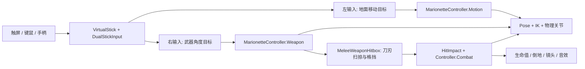

# 架构与帧顺序

## 数据流

## 文件职责

| 目录 / 文件 | 负责什么 |
| --- | --- |
| `Core/HaoxiGameDirector.cs` | 启动、角色生成、输入路由、胜负／暂停／重开和受击事件反馈。 |
| `UI/HaoxiGameDirector.Hud.cs` | HUD、摇杆、按钮、生命值和结果面板。 |
| `Presentation/StageBuilder.cs` | 程序化舞台、灯光、材质与镜头对象；共享配色。 |
| `Core/DuelCamera.cs` | 平滑跟随、最近对手选择、距离缩放和克制的受击抖动。 |
| `Core/GameplayTuning.cs` | 关键公共参数，按移动、武器、战斗、敌人和 Pose 分组。 |
| `Input/VirtualStick.cs` | 单个触点所有权、坐标换算、死区、拖动、双点与释放。 |
| `Input/DualStickInput.cs` | 多设备输入汇总为 Move / Weapon 两个 Vector2。 |
| `Puppet/MarionetteController.cs` | 单个角色的状态、构建、输入接口、复位和 LateUpdate 协调。 |
| `MarionetteController.Motion.cs` | FixedUpdate 顺序、地面移动、加减速与受击后的动态根节点。 |
| `MarionetteController.Weapon.cs` | 角度弹簧、刚体牵引、武器外形、持握、掉落和拾取。 |
| `MarionetteController.Combat.cs` | 部位修正、关节损伤、生命值、受击、击飞和倒地。 |
| `PuppetRig.cs` / `PuppetRig.Gait.cs` | 可见关节、Pose、两段 IK；独立文件维护落脚、跑步和转身步态。 |
| `PuppetDynamics.cs` / `PuppetBodyPart.cs` | 隐形刚体与物理关节、肌肉驱动、物理／视觉混合、部位识别。 |
| `Combat/MeleeWeaponHitbox.cs` | 刀刃跨帧扫掠、武器线段格挡、命中候选和重复伤害抑制。 |
| `Combat/HitImpact.cs` / `WeaponSpec.cs` | 一次命中的基础反应数据；每种武器的物理参数。 |
| `Combat/WeaponPickup.cs` / `ImpactAudio.cs` | 地面武器和拾取提示；程序化击打音效。 |
| `AI/EnemyTactics.cs` | 每个敌人的阶段状态，以及共享的闪避、攻防与间距规则。 |
| `Assets/Editor/` | 场景生成、WebGL 构建、多帧诊断和批处理入口，不进入 Player。 |
| `Scripts/Diagnostics/` | 探针用 `UNITY_EDITOR` 排除出 Player；组件留在 Editor 文件夹外才能在编辑器 Play 模式挂载。 |
| `Assets/Tests/Editor/` | NUnit 公式回归测试。 |

拆成多个文件的 `partial` 类仍然是一个组件。场景只挂 `HaoxiGameDirector`；角色只创建一次 `MarionetteController`。拆文件保持了原脚本 GUID、对象身份和执行顺序，避免为了整理改变行为。

## 三种更新节奏

1. **Update**：采集输入，导演传入玩家控制量，敌人策略传入速度、前摇／攻击标志。恢复短暂停顿、更新 UI、判断胜负。
2. **FixedUpdate**：控制器执行顺序为 -30，先更新根节点移动和恢复状态，再更新武器角度弹簧与力／力矩，并驱动物理肌肉。刀刃检测执行顺序为 20，读取武器刚体姿态并扫掠。Unity 物理求解结果在后续物理步骤继续反馈。
3. **LateUpdate**：用武器实际握柄位置、移动速度生成下一组 Pose 目标，捕获肌肉目标，再把物理偏移混合到可见身体并闭合 IK。镜头平滑更新；动作诊断在顺序 500 读取最终可见姿势。

可见 Pose、肌肉目标和真实刚体不是同一个状态。不要在多个系统同时直接覆写每根骨骼的位置；这是早期抖动和拉长肢体的主要来源。

## 根节点、关节与武器

- 地面行走根节点通常为 kinematic，由 `MovePosition` 移动；受击时变为 dynamic，允许击退／击飞冲量生效，稳定落地后再恢复走位控制。
- 15 个部位刚体通过 `ConfigurableJoint` 连接。自身部位互相忽略碰撞；真实受击使用部位的碰撞体与质量。
- 武器是独立、受重力影响的 Rigidbody，通过腕部约束连接。持握时其 Collider 为 Trigger；扫掠代码显式计算兵刃接触与伤害，避免武器被密集关节卡住。
- 视觉肢体用 IK 保持长度；受到局部损伤或死亡的部位改为跟随真实物理。死亡释放骨盆与走位根节点的连接，其他肢体连接继续保留。

## 15 个部位索引

`PuppetRig.PhysicalNodes`、`PuppetDynamics.Parents` 与关节损伤数组共享以下顺序，修改时必须同步：

| 索引 | 部位 | 物理父节点 |
| --- | --- | --- |
| 0 | 骨盆 | 行走根节点 |
| 1 | 胸 | 0 |
| 2 | 头，附颈部碰撞体 | 1 |
| 3 / 4 / 5 | 右肩 / 右肘 / 右腕（持武器） | 1 / 3 / 4 |
| 6 / 7 / 8 | 左肩 / 左肘 / 左腕 | 1 / 6 / 7 |
| 9 / 10 / 11 | 左髋 / 左膝 / 左踝 | 0 / 9 / 10 |
| 12 / 13 / 14 | 右髋 / 右膝 / 右踝 | 0 / 12 / 13 |

身体坐标为 Unity 的 Y-up：XZ 为战斗地面，Y 为重力／击飞轴。代码中的位置单位为米，速度为米／秒。角色层使用 Layer 8；换到其他工程时检查层冲突。

## 重开与工程还原

重开重新加载唯一启用的场景，恢复时间倍率，重新生成玩家、一个敌人和地面武器。角色销毁时从 `Combatants` 列表移除，并清理其物理关节容器。

`Packages/manifest.json` 与锁文件负责还原依赖，`Assets/*.meta` 保持资源引用。不要提交 `Library`、`Temp`、`Logs`、`UserSettings` 或 Unity 下载的引擎包。WebGL 成品适合放在 GitHub Release，源码仓库保留可重建的工程。
